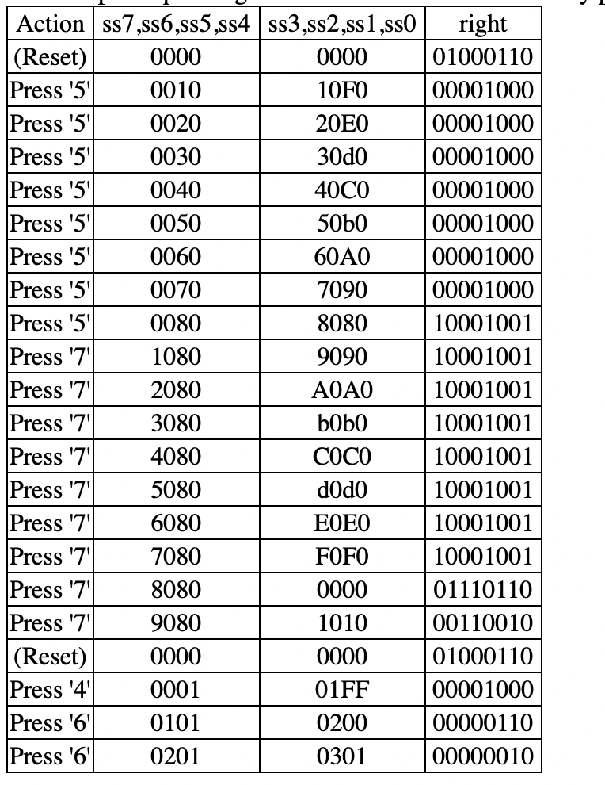

# Homework 11
## Step 26: Verilog Registers with Arithmetic [15 points]

Read these instructions completely before writing your code.  

Create a Verilog design, below, by using the standard 'top' module for the FPGA simulator. You may instantiate as many other modules as you need. In particular, you should use the 'ssdec' module for 7-segment decoding that you used for your labs. Get that ready now.

Your design should implement the following things one step at a time:

Use ssdec to display the hexadecimal value of four independent 4-bit binary counter registers on ss7, ss6, ss5, and ss4.  
The '7', '6', '5', and '4' buttons are clock inputs for the counters displayed on ss7, ss6, ss5, and ss4, respectively. For example, when ss7, ss6, ss5, and ss4 display 0000, and the '6' button is pressed, the display should change to 0100. After that, when the '7' button is pressed, the display should change to 1100. After that, when the '6' button is pressed again, the display should change to 1200.  
At startup, or whenever reset (3-0-W) is asserted, all registers and counters should immediately go back to zero (an asynchronous reset of the counters) and the values displayed on all 7-segment displays should be zero.  
Combining the values displayed on {ss7,ss6} and {ss5,ss4} as 8-bit quantities, compute the 8-bit sum and display it on {ss3,ss2}. For instance, if {ss7,ss6} display "4 3" and {ss5,ss4} display "5 F", the 8-bit hexadecimal sum should appear on {ss3,ss2} as "A 2".  
Combining the values displayed on {ss7,ss6} and {ss5,ss4} as 8-bit quantities, compute the 8-bit difference ({ss7,ss6} minus {ss5,ss4}) and display it on {ss1,ss0}. For instance, if {ss7,ss6} displays "4 3" and {ss5,ss4} displays "5 F", the 8-bit hexadecimal difference should appear on {ss1,ss0} as "E 4".  
Display the computed flag values for the addition and subtraction operations:  
- right[7] is the N flag for the addition
- right[6] is the Z flag for the addition
- right[5] is the C flag for the addition
- right[4] is the V flag for the addition
- right[3] is the N flag for the subtraction
- right[2] is the Z flag for the subtraction
- right[1] is the C flag for the subtraction
- right[0] is the V flag for the subtraction
Just to clarify a few things: You do not need modules like 'synckey'. There are only four inputs: pb[7], pb[6], pb[5] and pb[4], and they clock the counters on the rising edge. You do not need to use clocked registers to hold the 8-bit sum, 8-bit difference, or the flag values. You may use any Verilog operator (like '+' or '-') to implement this design. Remember that you can use the built-in key combination 3-0-W to assert reset.  

An example of pressing the '5' button 8 times followed by pressing the '7' button 9 times, and then resetting and pressing '4' and '6' a few times, should result in these patterns:

