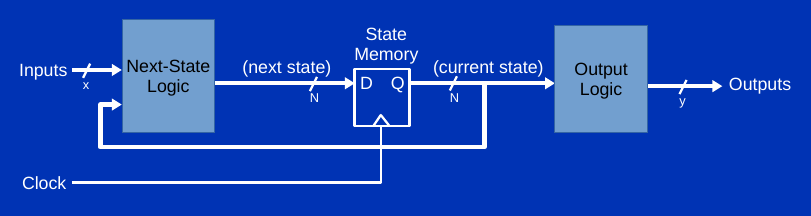

# Homework 7

The purpose of this homework assignment is to practice using behavioral Verilog constructs (always blocks, case, if, etc). For combinational blocks, the result will be no more efficient than the two-dimensional "map" arrays you learned about before to create multiplexers. It will, however, be more compact.

For instance, consider a combinational block with a two-bit input, 'x', and a three-bit output, 'y'. We can represent the three-bit result for any of the four combinations of the two input bits using a case statement.
```
    always_comb
    begin
        case(x)
            2'b00: y = 3'b001;
            2'b01: y = 3'b110;
            2'b10: y = 3'b110;
            2'b11: y = 3'b010;
        endcase
    end
```
Note that a case statement can occur only inside some kind of always block (always_comb, always_ff, or always_latch). It is often good practice to include a default statement with any case expression, but if all possible input combinations are covered, a default statement would be redundant and unnecessary. Also note that expressions like "y = 3'b010" are done without an "assign" statement. This is intentional and correct. <br />

Expression of sequential logic is the primary goal of using behavioral constructs. By doing so, we can create compact representations of useful things like general Mealy and Moore machines, and shift registers. <br />

For this assignment, create a new workspace in the simulator named "hw7". Add new files for each question and name them appropriately. Remember to put the simulator into "File Simulation" mode rather than "Workspace Simulation". <br />

**Scoring Rubric**

This homework will be automatically graded. There are a few general rules for ensuring you receive a good score. In particular, if your code does not compile and simulate, you should expect to receive no points for the problem. Individual points will be deducted for reasons of:
- using the wrong type of reset (i.e., asynchronous or synchronous)
- setting the wrong value upon reset
- using the wrong signal for clock or reset
- using the wrong signal for output

For each question, read carefully to understand the specified outcomes of clocks and resets. Your work will be graded according to those instructions. <br />

## Step 1: A combinational block with Verilog case [10 points]

Create a SystemVerilog module named map4 that accepts a 4-bit input named 'in' and produces a 4-bit output named 'out'. In this module, create an always_comb block containing a case statement. The case statement should create the following mapping between in and out:  
in         out  
4'h0     4'hb  
4'h1     4'h3  
4'h2     4'h7  
4'h3     4'h8  
4'h4     4'h1  
4'h5     4'hf  
4'h6     4'h0  
4'h7     4'hd  
4'h8     4'h2  
4'h9     4'he   
4'ha     4'h5  
4'hb     4'h4  
4'hc     4'h9  
4'hd     4'ha  
4'he     4'h6  
4'hf     4'hc  

The map4 module should be instantiated into a standard top module in the simulator like so:
```
  logic [3:0] in4;
  logic strobe;
  enc16to4 e(.in(pb[15:0]), .out(in4), .strobe(strobe));
  logic [3:0] out4;
  map4 m(.in(in4), .out(out4));
  ssdec s(.in(out4), .out(ss0[6:0]), .enable(strobe));
```
Use the `ssdec` and `enc16to4` modules that you wrote for lab 6 to test the functionality of your map4 module. When you are satisfied it is working, copy and paste only the map4 module below. (You do not need to show us `ssdec` and `enc16to4` again. We will provide our own when we need to check your work.)


## Step 2: An always_ff block [5 points]

You have experimented with the instantiation of structural flip-flops using the modules provided for you for lab 7. Now, you will consider direct creation of flip-flops using behavioral descriptions. This will be the case for the rest of the course, so we begin slowly and make sure that each element is understood.  

Create an always_ff block to describe the operation of a single logic signal named "state". Asynchronously clear the state signal when the pb[1] signal is asserted. On the rising edge of the pb[0] signal, set the state signal to ~state. This is simple enough that there is no need to create a separate next-state combinational logic block to accomplish the update. Remember this this is an always_ff block, so be sure to use the "<=" operator. Outside of the always_ff block, connect state to the red port so it can be observed.  

In other words, as long as the '1' button is pressed, the red light will remain off — regardless of the activity of the '0' button. When the '1' button is released, each press of the '0' button will cause the red LED to toggle.  

This will be a fundamental activity from now until the end of the course. If you have questions about this, it would be advisable to review lecture module 3-E, pages 19–33 as well as talk to a TA immediately.  

Copy and paste the entire top module into the box below. There are no other modules to write for this question.  


## Step 3: An always_ff block with four-bit state and asynchronous reset [15 points]
Creation of individual flip-flops is not particularly commonplace or useful. A greater goal is to become facile with creation with groups of flip-flops that are clocked together (synchronously). A group of flip-flops that serve a similar purpose is called a register and behavioral Verilog makes it easy to create registers of any size.  

Create an always_ff block to describe the operation of a four-bit logic bus named "state". Asynchronously set the state bus to 4'h0 when the pb[1] signal is asserted. On the rising edge of the pb[0] signal, set the state bus to another bus of the same size named "next_state". The next_state value should be created using the same combinational mapping you built for question 1, above. Copy the always_comb and case constructs, and change the signal names from "in" and "out" to "state" and "next_state", respectively. In other words, the selector for the case statement will be the state bus. Outside of the always_ff and always_comb blocks: This time, put the always_comb block to compute next_state in the top module rather than putting it in another module. <br />
- connect state to the left[7:4] ports so it can be observed directly
- also connect the state bus to the in port of an instance of the ssdec module you built in lab6. Connect the out port of that ssdec instance to the ss7 seven-segment LED display.
- connect next_state to the left[3:0] ports so it can be observed directly
- also connect the next_state bus to the in port of another instance of the ssdec module you built in lab5. Connect the out port of that ssdec instance to the ss5 seven-segment LED display.


The ss5 display always shows the next_state. As long as the '1' button is pressed, the ss7 display should show the start state. When the '1' button is released, the rising edge of pb[0] will cause ss7 to change to the value most recently displayed on the ss5 display before pb[0] was pressed. <br />

Pressing the '0' button should cause the ss7 display to advance through the combinational mapping. Pressing it exactly 16 times will bring it back to the original start state. <br />

Copy and paste the entire top module into the box below. Do not copy the ssdec module. There are no other modules to write for this question. <br />


## Step 4: An always_ff block with four-bit state and asynchronous/synchronous resets [15 points]

Revise the system from problem 3 to add a synchronous reset. This will co-exist with the asynchronous reset you already implemented.

To do so:  
- Change the always_comb block in which you implemented the combinational mapping from question 1. When pb[2] is not asserted, it works as it did in probem 3 (and problem 1). When pb[2] is asserted, next_state is set to 4'h1. When pb[2] is asserted, a rising edge of a clock (pb[0]) will cause the altered next_state value to become the new state. For this reason, it is considered to be a reset that applies only on the rising edge of the clock. It is a synchronous reset. By comparison, asserting pb[1] at any time will change the state value. It does not wait for the clock, so it is an asynchronous reset.  

We're going to leave the exact details up to you for how you implement the new case statement. The one stipulation is that you must use a single case statement in a single always_comb block to do this. Yes, we want you to think about this for a bit. Perhaps you want to concatenate {state,pb[2]} and build a 32-entry case statement. Maybe use a default case. Maybe some hybrid of the two. Maybe change the order of the concatenation. There are several possibilities. Please give it five minutes of thought. What would make it easiest to understand? What would make it easiest to implement? This contemplation will be helpful for you in future design experiments.  

Test your module as you did in the previous steps. When you are certain it works as it is expected to, copy and paste the entire top module into the box below. Do not copy the `ssdec` module. There are no other modules to write for this question.


## Step 5: A Moore machine [15 points]
Change the system you created in problem 4 to include an combinational output logic block. Once you do this, consider that you will have a 

Even your work in problem 2 constituted a degenerate form of a Moore machine. The Output Logic was simply passed through, and the Next-State Logic was just an inverter with no inputs.   

This time, create a second always_comb block with a case statement that implements the following mapping:
state      outlog  
4'h0      4'h2  
4'h1      4'h7  
4'h2      4'h3  
4'h3      4'h9  
4'h4      4'hf  
4'h5      4'hb  
4'h6      4'he  
4'h7      4'hd  
4'h8      4'h4  
4'h9      4'h6  
4'ha      4'h8  
4'hb      4'h0  
4'hc      4'ha  
4'hd      4'hc   
4'he      4'h1  
4'hf      4'h5  

This new case statement does not replace the one you created in problem 1 and which you continue to use now to determine the next_state. Instead, the new case statement creates a new mapping between state and outlog.  

The pb[2] signal is the sole synchronous input that switches the Next-State Logic between a 16-to-16 permutation or the synchronous reset value, and the Output Logic is a 16-to-16 permutation of the state bus. To test the correctness of your work, add the following connections: <br />
- Connect outlog to right[7:4]
- Connect outlog, decoded with another instance of `ssdec`, and display it on ss2.
Now, the system should display the current state on ss7, the next_state on ss5, and the translated output on ss2.

Test your module as you did in the previous steps. When you are certain it works as it is expected to, copy and paste the entire top module into the box below. Do not copy the `ssdec` module. There are no other modules to write for this question.


## Step 6: A Simple Shift Register [10 points]
Another common type of Moore machine is a shift register. You built a simple 4-bit ring counter in lab 7, which was a form of a circular shift register. It is much easier to build digital systems with an FPGA than it is to wire them on a breadboard, so let's build a larger — but still simple — shift register.  

This time, start with a bare top module template in a new file in the simulator workspace. In the top module, create a 17-bit logic bus named "shift". Connect it to the concatenation of {left,red,right}.   

Create an always_ff block to update the shift logic bus in the following ways:  
- When the reset signal is asserted (by pressing 3-0-W), set the shift logic bus to 17'b1. This bit literal means 17 bits, with only the least significant bit set to 1.
- When the pb[19] ('Z' button) is asserted, the shift logic bus will be set to {shift[15:0],shift[16]}. This is simple enough Next-State Logic that you do not need a separate always_comb to implement it. Just use a "<=" assignment in the always_ff to update it.

The reset port of the top module is discussed on page 33 of lecture module 3-E. When the system is "powered up", the reset signal will automatically stay high for four cycles of the hz100 clock. It will also go high whenever the '3', '0', and 'W' buttons are pressed simultaneously. How does it do this? It turns out that there is a module in the simulator that is at a higher level of hierarchy than the top module. In that "higher-than-top" module, there is a three-input AND gate that watches the '3', '0', and 'W' buttons to start a state machine that keeps the reset line high for four cycles. This same state machine is also started when the a new design is put in place. To be clear: You do not need to make your own AND gate to watch for a simultaneous 3-0-W press.   

When your design works, you will be able to press the 'Z' button and the single illuminated LED will move to the left, off the left edge, and go back to the rightmost right[0] LED. Pressing 3-0-W at any time will cause the system to restart with only the rightmost LED illuminated.  

Test your system well, and submit the entire top module below. There are no other modules for this problem.  

## Step 7: A Slightly More Useful Shift Register [15 points]
Create a new simulator file and new top module template. Create a four-bit bus named "encode", and connect it to the output of a 16-to-4 encoder whose inputs are connected to pb[15:0]. This time, create a 32-bit shift register named "shift". Create a 32-bit logic bus named "next_shift", and use a dataflow statement to connect it to {shift[27:0],encode}. Then create an always_ff block to update shift as follows:
- If the reset signal is asserted (by pressing 3-0-W), set the shift value to 32'b0.
- On the rising edge of pb[19] ('Z' button), set shift to next_shift. This is within an always_ff block, so remember to use a "<=" assignment.

Display the 32-bit shift register on the eight 7-segment LED displays by creating eight ssdec instances and connecting them as follows:  
```
ssdec s7(.in(shift[31:28]), .out(ss7[6:0]), .enable(1));
ssdec s6(.in(shift[27:24]), .out(ss6[6:0]), .enable(1));
ssdec s5(.in(shift[23:20]), .out(ss5[6:0]), .enable(1));
ssdec s4(.in(shift[19:16]), .out(ss4[6:0]), .enable(1));
ssdec s3(.in(shift[15:12]), .out(ss3[6:0]), .enable(1));
ssdec s2(.in(shift[11: 8]), .out(ss2[6:0]), .enable(1));
ssdec s1(.in(shift[ 7: 4]), .out(ss1[6:0]), .enable(1));
ssdec s0(.in(shift[ 3: 0]), .out(ss0[6:0]), .enable(1));
```
This manner of decoding and displaying a 32-bit value on the 7-segment values is one you will see again soon.

The system should work as follows: When any of the 16 pb[15:0] buttons are held down, the rising edge of pb[19] will cause the digit pressed to appear on ss0. The previous eight digits will be shifted to the left by one display.  

It is tempting to try to make the act of pressing a digit like '9' make a '9' instantly appear on ss0 without having to press 'Z'. We can't quite do that without going through a few more lectures.  

When you finish implementing the design, submit only the `top` module below.

## Step 8: Almost the Same Shift Register [15 points]
For this problem, you will implement almost the same thing as problem 7.
- Instead of a 32-bit logic bus, create a 64-bit logic bus, and name it "shift".
- Create an instance of the `enc16to4` module, connect its input to pb[15:0], and connect its output to a 4-bit logic bus named "encode" as before. This time, create a single instance of `ssdec` with its input connected to "encode", and it's output connected to a 7-bit signal named "decode".
- Create a 64-bit next_shift logic bus and assign the following to it: {shift[55:0],1'b0,decode}
- Connect {ss7,ss6,ss5,ss4,ss3,ss2,ss1,ss0} to shift.
- Create an always_ff block to update the shift register in the following way:
    - When the reset signal is asserted, set shift to 64'b0.
      - On the rising edge of pb[19] (Z button) set shift to next_shift.
Now, the display will be set to blank on reset, and new digits will be added on the right and move to the left when the 'Z' button is pressed.

Test your code as you did before, and turn in only the `top` module below.
