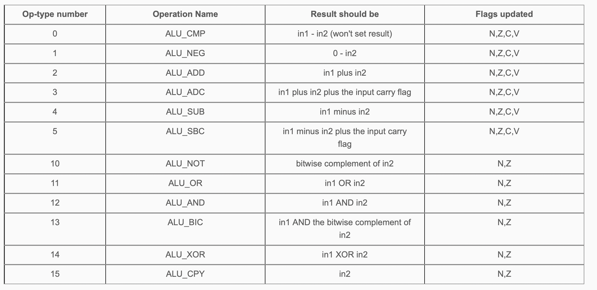

# ECE 270 Lab Experiment 13: Instructions and the ALU
## Introduction
We move on to the simple computer portion of Module 4 in this lab, where you will implement one of the most crucial modules in any computer - the arithmetic logic unit, or ALU. It handles basic arithmetic (+ - * /) operations on simple integer numbers, as well as bitwise operations. No computer can be truly useful without an ALU - you'll find it in all hardware that utilizes basic mathematical and shifting operations, such as CPUs, floating-point units (which handle decimal representations of numbers), GPUs, etc.  

For this lab, you will implement an ALU module for a given simple computer, capable of handling arithmetic and bitwise instructions, as an alu module. To be clear, this is how your alu module would fit into the simple computer (screenshot from Module 4-G, which you should read for further understanding).  

The simulator has been preloaded with the design of the rest of the simple computer modules (pc, idms, mem, ir) which you will implement in the next lab, but for now, your focus will be the ALU, which is given two operands and the operation to be performed on them, and produces the result of that operation and/or updates the relevant flags - N for negative result, Z for zero result, C for value of carry-out, and V for whether an overflow occurred.  

## Step 0: Prelab
- Read the notes for module 4-G.
- Read the entire lab document.
- Do the prelab assignment on the course web page.

You will notice that the time it takes to synthesize designs has increased quite significantly for this lab, so you should not immediately assume that your code is hanging if it takes longer than a few seconds. The simulator will time out at 30 seconds after it has received and started synthesizing your code, so if your code does not compile under that time, you can then assume that there is a problem with your code. Typically, an efficient and correct ALU module takes around 5-10 seconds to compile.  
## Step 1: Implement result generation in a new ALU module
You will need to copy in the ssdec and scankey modules from previous labs to be used later. Do not add any instantiations - the support13 module you will instantiate later will use them instead.  

Start by creating a new module, alu, with the following format.  
```
      module alu (
        input logic clk, rst,         // clk and rst for handling flag updation
        input logic [31:0] in1, in2,  // the operands the ALU will act on,
        input logic fue,              // the Flag Update Enable, which, if high,
                                      // allows fout to be updated on rising edge of clk
        input logic [4:0] op,         // the current operation,
        output logic [31:0] out,      // the result of the current operation,
        output logic [3:0] fout       // the flags of the current operation.
      );

      endmodule
```
The instructions to be implemented for the ALU:


You should not instantiate this module in the top module. It will be used by another module, embedded in the simulator, which you will instantiate later. Within the module, do the following:

- Instead of checking directly for the corresponding opcode-type numbers for each operation, you can use the name of the operation directly, which has been assigned to its corresponding number. To be clear - you do not need to define them yourself after you instantiate the support13 module. This will make it easier to refer to operations by name instead of their opcode-type number. For example, if you wanted to check if the current operation is to add the values of two registers (ALU_ADD), instead of checking op == 0 for ALU_ADD, you can instead write: `op == ALU_ADD`.  
- Define four logic variables called Ncur, Zcur, Ccur, Vcur, and correspondingly assign them to fout[3], fout[2], fout[1], fout[0] (the fout terms being on the right-hand side). This should make it easier to refer to the current state of the flags by name instead of having to index into fout.  
- In addition, define four logic variables called N, Z, C, V, and set all their values to 1. You will change these to their correct expressions in the next step.  
- Define a 4-bit logic bus called nfout. This will be a gatekeeper, of sorts, to prevent changing the flags if the operation performed is not supposed to change them, and will be used as the next-state logic for the flip-flops you will implement in step 2 (the current state being fout). <br />

In a new combinational always block, use a case statement to check the value of op, perform the operation that it specifies, and place the result into out while updating the next-state logic for the flags (nfout). The format should be as follows: <br />
```
  always_comb begin
    case (op)
      ALU_ADD: begin out = in1 + in2;  nfout = {N,Z,C,V}; end
      // add other operations below...

      default: begin out = 0; nfout = {Ncur, Zcur, Ccur, Vcur}; end
    endcase
  end
```
You will do this for each of the other operations, setting out depending on the operation description in the table above, and nfout to a concatenation of either new or old values of flags. What that means is that for an operation that only updates N and Z (ALU_OR, for example), you should set N and Z in nfout (since N and Z are combinationally assigned and updated immediately), whereas in place of C and V you would use Ccur and Vcur (which are the values from the previous operation, since ALU_OR should not update these flags). For an operation that updates all the flags, however, you should assign {N,Z,C,V} to nfout. <br />

We recommend that you condense each operation into a single line similar to the one done for ALU_ADD, otherwise your code may become too long to read and subsequently debug. The begin/end pair is required since you're setting two statements for each operation. <br />

Once you've implemented the instructions, you can verify your results by adding the following instantiation to your top module:
```
support13 sup (.clk (hz100), .reset (reset), .in (pb), .out7 (ss7), .out6 (ss6), .out5 (ss5), .out4 (ss4), .out3 (ss3), .out2 (ss2), .out1 (ss1), .out0 (ss0));
```
The support13 module implements an instruction set trainer, which can be used to check that your ALU is correctly implementing operations. It basically implements the rest of the simple computer shown in the picture in the introduction above. For this step, you will only need to check that your ALU is producing the right result - you will set and check the flags in the next step. <br />

As a reminder, you do not need to instantiate the alu, ssdec or scankey modules yourself - the support13 module will do it for you, and this should be the only line in your top module. <br />

To ensure that support13 is added to your design, make sure to add the file "support_lab13.sv" in Workspace Settings. <br />

The instruction trainer starts with a prompt that looks like "INSt0000". It is waiting for you to enter a 4-digit instruction on the keypad. Excess digits will be shifted off to the left, so if you make a mistake in entering an instruction, you can simply keep pressing digits until the correct instruction appears. The instructions recognized are the single-register and two-register instructions of the simple computer described in the lecture notes. For instance, the instruction 9450 should load the hexadecimal value 00000045 into register 9. <br />
Enter 9450 with the keypad and press W to execute the instruction. By default, the instruction is not cleared, and you may press W again to repeat the execution of the instruction.
In instruction entry mode, you may eXamine the flags by pressing the X key, press it again to go back to instruction entry. <br />
In addition to instruction entry, two other modes can be used.    
- Press Z to switch to register debug mode. It shows a prompt that looks like "rEg 0".
  - Press the digit 0 – F for the register you want to inspect.
  - Press X to eXamine the register. Press X again to select a different register.
  - Press W to modify the register. Enter an 8-digit number, and press W to store it.
- Press Z again to switch to memory debug mode. It shows a prompt like "Addr 0".
  - Enter a 4-digit memory address and press X to eXamine it, and W to modify it.
- Press Z once more to switch back to instruction entry mode. <br />

Enter instructions that will exercise the ALU operations you implemented. At this point, the four flags will always be on. Making those correct will be the next step. For now, make sure that the correct values are placed in the registers for the instructions you enter.  

To do so, use the table below to perform different operations (one after each other, and do not assert reset at any point):  
```
        Initial values   Instruction    Final value     check with instructions...
        R0=12, R1=49     ADD  R0,R1     R0 = 5b         0120  1490  0213
        R0=49, R1=12     SUB  R0,R1     R0 = 37         0490  1120  0413
        R1=1             NEG  R0,R1     R0 = ffffffff   1010  0113
        R0=11, R1=22     OR   R0,R1     R0 = 33         0110  1220  0b13
        R0=a9, R1=9a     AND  R0,R1     R0 = 88         0a90  19a0  0c13
        R0=76, R1=11     BIC  R0,R1     R0 = 66         0760  1110  0d13
        R0=76, R1=11     XOR  R0,R1     R0 = 67         0760  1110  0e13
        R1=1             NOT  R0,R1     R0 = fffffffe   1010  0a13
        R0=ffffff55      LDBI R0,#ff    R0 = 000000ff   0aa0  0a03  0ff0
```
Try each test by executing the "check" instructions, and then eXamining register 0. For instance, to test the "ADD R0,R1" instruction, press: `0120 W 1490 W 0213 W Z X` and you will view the result in R0. Press Z, and Z again, to get back to instruction entry. <br />

Finally, to make this as absolutely transparent as possible, we include the typical animation for the step. This one shows the instructions from above being typed out slowly, so you can see which buttons cause certain changes, and then displays the value of register 0 after each set of instruction executions. <br />


## Step 2: Implement flag value generation in the ALU
This step pretty much just involves setting up the expressions for N, Z, C and V from earlier, instead of just 1, and setting upthe flip-flops for fout (which you didn't assign in the previous step, which is okay). The flags are used to inform the computer of basic facts about the final result - whether it's negative, zero, had a carry-out bit, or the operation producing it caused an overflow.   

For each of the flags, write and assign an expression in place of "1" so that the flag goes high when its conditions are met.  
- For the N/negative flag, check that out[31] is 1.
- For the Z/zero flag, check that out is 0. A good way to do this (and get used to using operators) would be to OR the bits of out, then apply a NOT to the ORed out. That results in a 5-character expression (excluding optional parentheses) which returns 1'b0 if any of the bits of out are 1.
- For the C/carry flag, there are multiple cases that we need to take care of. You will first need to check if the incoming operation in op is either an addition (ADD/ADC) or a subtraction operation (SUB/SBC). If it's an addition operation, check the following:
  - If in1[31] and in2[31] are both 1, then we know they must generate a carry-out.
  - If in1[31] is 1, but out[31] is 0, it must be because a carry was generated or propagated.
  - If in2[31] is 1, but out[31] is 0, it must be because a carry was generated or propagated.
  If at least one of these conditions is true, and the current operation is addition, C should be 1. However, if it's a subtraction operation, you will do the the same as above, but complement in2[31].
- For the V/overflow flag, all we would need is the 33rd bit of the result, but since we're limited to 32 bits long, we'll need to use a bit of sorcery here to determine the conditions when the 33rd bit would be 1. V should be 1 when:
  - During an addition operation (ADD/ADC), if the sign bits of in1 and in2 are both 1 and the sign bit of out is 0 OR the sign bits of in1 and in2 are both 0 and the sign bit of out is 1. (if you are confused what a sign bit is, go through Module 4-A.)
  - During a subtraction operation (SUB/SBC), the sign bits of in1 and ~in2 are both 1 and the sign bit of out is 0 OR the sign bits of in1 and ~in2 are both 0 and the sign bit of out is 1.

Now, set up an always_ff block utilizing the rising edges of clk and rst, which will do the following: <br />
- If rst is 1, fout will be set to 0.
- Otherwise if fue is 1, fout will be set to nfout. (Remember, you do not need an else case in an always_ff block, so just this condition is fine.) <br />

And that's your ALU! <br />

You can hand-verify some more instructions and your flags with the table below, using the trainer guide given in the previous step. Before performing the instructions further below, reset your design, and then set the following registers using the rEg instructions for modifying registers above:
- R1 = 00000001  
- R2 = 00000002  
- R8 = 80000000  
- R9 = FFFFFFFF  

Then, try these instructions, and verify that the result in R0 and the flags match correctly. The flag descriptions are as follows: If the letter for the flag is shown, it is high, otherwise if it's represented with an underscore (\_) then the flag is low. For example, if the expected flags for an operation are N\_C_, then only N and C are high, while Z and V are low, indicating that the result is negative, required the use of a carry/borrow, is not zero, and the operation that produced it did not result in an overflow.

```
      Instruction     Encoding        Expected Flags      Result stored in R0
      CPY R0,R8       0f83            N___                80000000
      ADD R0,R0       0203            _ZCV                00000000
      ADD R0,R1       0213            ____                00000001
      SUB R0,R1       0413            _ZC_                00000000
      SUB R0,R1       0413            N___                FFFFFFFF
      NEG R0,R1       0113            N___                FFFFFFFF
      ADD R0,R1       0213            _ZC_                00000000
      XOR R0,R8       0e83            N_C_                80000000
      ADD R0,R0       0203            _ZCV                00000000
      ADC R0,R9       0393            _ZC_                00000000
      SBC R0,R1       0513            _ZC_                00000000
```
Here is a full walkthrough of presetting the registers R1, R2, R8 and R9, followed by the execution of the aforementioned instructions, displaying the flags and the value of R0 after the entered instruction has been executed.

**For the final submission in the postlab, include the modules top, ssdec, scankey and alu.**

>Questions or comments about the course and/or the content of these webpages should be sent to the Course Webmaster. All the materials on this site are intended solely for the use of students enrolled in ECE 270 at the Purdue University West Lafayette Campus. Downloading, copying, or reproducing any of the copyrighted materials posted on this site (documents or videos) for anything other than educational purposes is forbidden.
